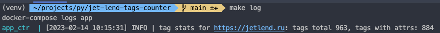

# jet-lend-tags-counter

#### Скрипт для получения статистики по тегам в html-теле заданного урла 
Результатом работы скрипта является вывод общего кол-ва тегов и кол-ва тегов, имеющих атрибуты, 
в html-теле заданного урла. 

Для примера использован урл `https://jetlend.ru`

#### Деплой:

- сборка и старт скрипта - `make run`
- завершить выполнение скрипта - `make kill`
- просмотр результата - `make log`

Контейнер со скриптом автоматически завершает работу через 60 секунд после старта. 
Результат работы скрипта выводится в логах контейнера с приложением:

 
